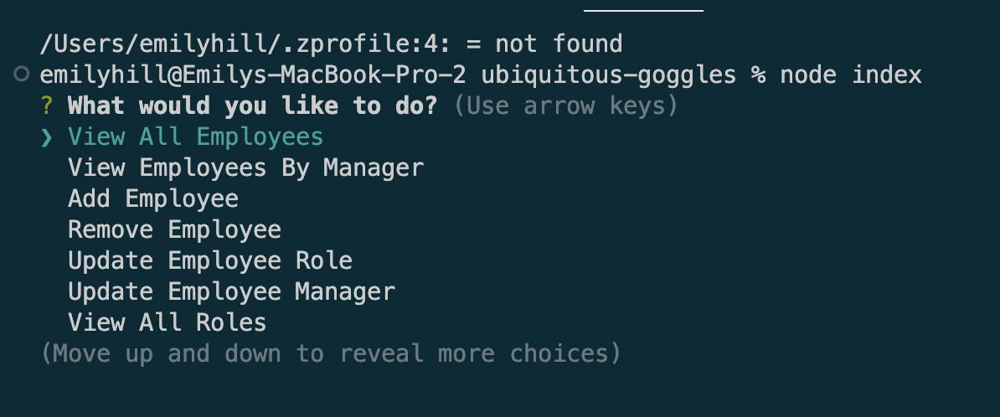
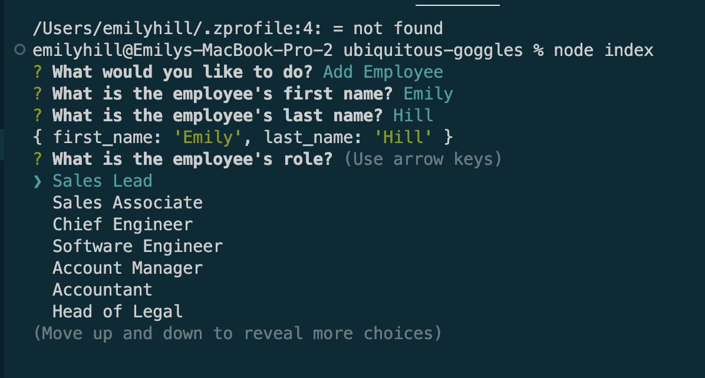
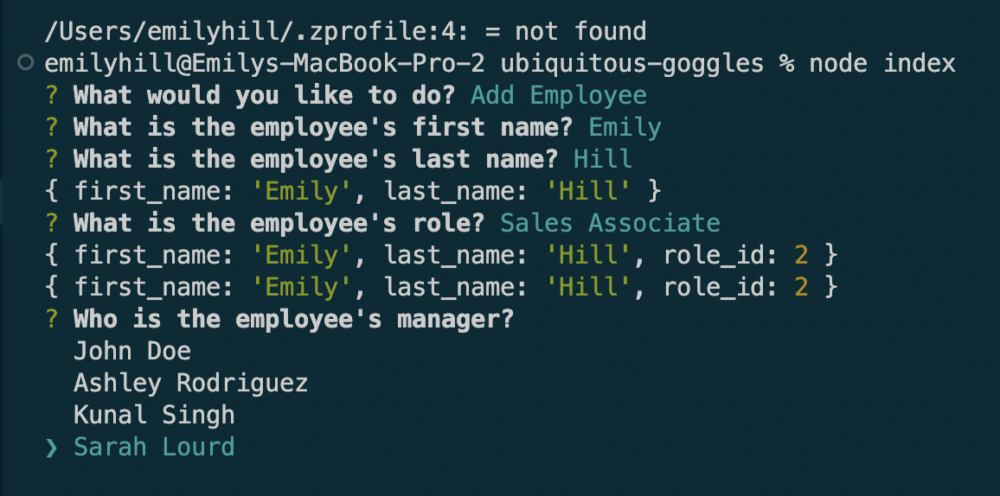
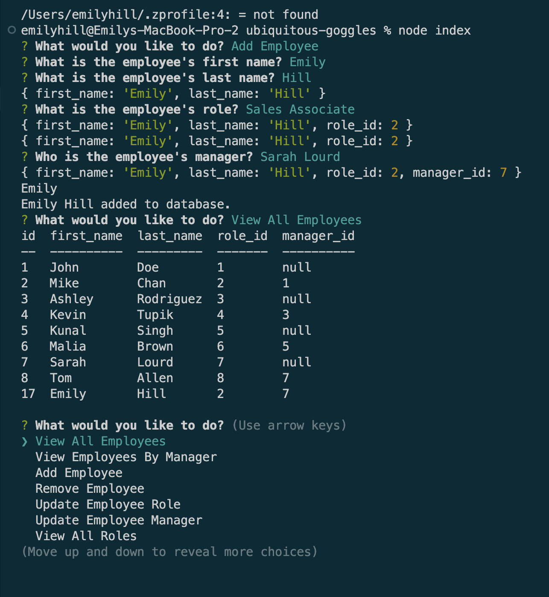
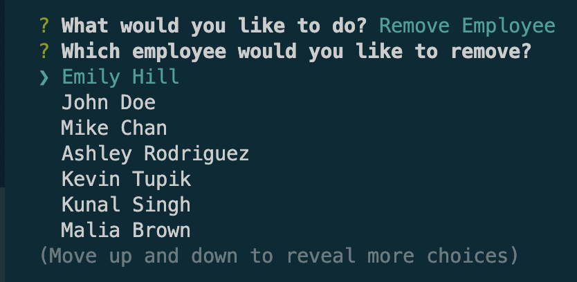
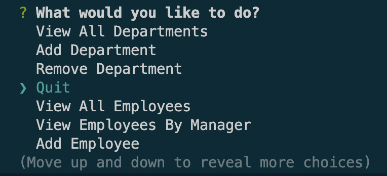
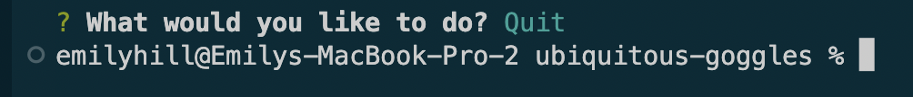

# Employee Tracker

## Description 
This project is a command-line application that manages a company's employee database using a content management system or a user interface that allows him or her or them to easily view and interact with information stored in the database.

## Table of Contents
[Installation](#installation)
[Usage](#usage)
[Future Iterations](#future-iterations)
[License](#license)

## Installation
In order to use this application, the user should install the <a href="https://www.npmjs.com/package/inquirer/v/8.2.4">Inquirer</a>, <a href="https://www.npmjs.com/package/mysql2">MySQL2</a>, and <a href="https://www.npmjs.com/package/console.table">console.table</a> packages. 

## Usage 
To view the working app, please click the link below. 
https://drive.google.com/file/d/1P0naV0ZfOor2XbVqjyCwueLM15C_kA_U/view
First, the user will call the program by typing "node index". 
Then, the user will select which action they would like to take based off of a list of options provided. 

Based off of the user's selection, a series of relevent questions will be asked to obtain the necessary information to put into the database or to view a table already in the database. 

The user will select the "quit" option in order to exit node js. 

## Future Iterations 

Future iterations of this project will include viewing a department's total budget and viewing an employee by department. 

## License 
[MIT](https://choosealicense.com/licenses/mit/) 

